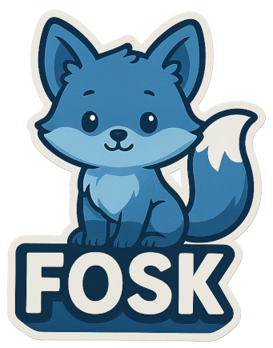

# FOSK



`fosk` is a small in-memory JSON collection crate that provides a lightweight,
thread-safe collection API with configurable id strategies and simple schema
inference. Collections are created from a `Db` instance (see `seed_db` in the
test fixtures for a real-world example).

This README demonstrates the intended usage pattern: create a `Db` with a
`Config`, then create named collections from that `Db`.

## Requirements

- Rust toolchain (stable)
- `serde_json` for JSON values used with the collections

## Adding to your project

If you're developing locally, add the crate as a path dependency in your
`Cargo.toml`:

```toml
[dependencies]
fosk = "0.1.0"
serde_json = "1"
```

## Quick example (use `Db` + `Db::create`)

This example follows the pattern used in the repository tests: create a
database handle, then create named collections from that database. The
collection objects are thread-safe handles that expose convenient CRUD and
aggregation methods.

```rust
use fosk::database::{Db, Config};
use serde_json::json;

fn main() {
    // Create a Db with integer id strategy (id key = "id")
    let db = Db::new_db_with_config(Config::int("id"));

    // Create or retrieve named collections from the Db
    let people = db.create("People");

    // Add a document (collection returns the stored item with id populated)
    let stored = people.add(json!({ "name": "Alice", "age": 30 }));
    let stored = stored.expect("item should be added");

    // Get the id and retrieve it back
    let id = stored.get("id").and_then(|v| v.as_str()).unwrap().to_string();
    let retrieved = people.get(&id).expect("should exist");
    println!("retrieved = {}", retrieved);

    // Collections also support pagination and batch operations
    let all = people.get_all();
    println!("all items: {}", all.len());
}
```

Note: `db.create(name)` returns the collection handle used throughout the
tests (see [`src/executor/_tests.rs::fixtures::seed_db`](https://github.com/lvendrame/fosk/blob/main/src/executor/_tests.rs)). In the tests the collection handle is used directly for queries and assertions.

## Query example — SELECT with JOIN, GROUP BY and ORDER BY

Below is a concrete example that mirrors the SQL used in the test
[report_top_categories_by_city_complex_joins](https://github.com/lvendrame/fosk/blob/main/src/executor/_tests.rs#L540):
it performs a 4-way join (People, Orders, OrderItems, Products), groups by
city and category and returns aggregated KPIs per (city,category).

```rust
// Option A: inside this repository/tests use the fixture to seed data:
// use crate::executor::fixtures;
// let db = fixtures::seed_db();

// Option B: seed manually (standalone example):
// use fosk::database::{Db, Config};
// use serde_json::json;
// let db = Db::new_db_with_config(Config::int("id"));
// let people = db.create("People");
// people.load_from_json(json!([ /* ...rows... */ ])).unwrap();
// // create Products, Orders, OrderItems similarly

let sql = r#"
    SELECT
      p.city AS city,
      pr.category AS category,
      COUNT(DISTINCT o.id) AS orders,
      SUM(oi.quantity) AS items
    FROM People p
    JOIN Orders o      ON o.person_id = p.id
    JOIN OrderItems oi ON oi.order_id = o.id
    JOIN Products pr   ON pr.id = oi.product_id
    WHERE p.city IN ('Porto', 'Lisboa')
    GROUP BY p.city, pr.category
    HAVING SUM(oi.quantity) >= 1
    ORDER BY city ASC, items DESC, category ASC
    LIMIT 10
"#;

let rows = db.query(sql).expect("query should succeed");
for row in rows {
    let city = row.get("city").and_then(|v| v.as_str()).unwrap_or("");
    let category = row.get("category").and_then(|v| v.as_str()).unwrap_or("");
    let orders = row.get("orders").and_then(|v| v.as_i64()).unwrap_or(0);
    let items = row.get("items").and_then(|v| v.as_i64()).unwrap_or(0);
    println!("{} / {} -> orders={}, items={}", city, category, orders, items);
}
```

This example shows how to run expressive reports using the crate's SQL-like
engine. Inspect the repository tests for more real-world queries and
validation patterns.

## Main types & API

- `Db` — top-level database handle. Create with `Db::new_db_with_config(config)`.

  - `create(name: &str) -> Arc<DbCollection>` — create or get a named collection.

- `DbCollection` — user-facing collection handle (thread-safe). Preferred
  operations:

  - `get_all() -> Vec<serde_json::Value>`
  - `get_paginated(offset: usize, limit: usize) -> Vec<serde_json::Value>`
  - `get(id: &str) -> Option<serde_json::Value>`
  - `exists(id: &str) -> bool`
  - `count() -> usize`
  - `add(item: serde_json::Value) -> Option<serde_json::Value>`
  - `add_batch(items: serde_json::Value) -> Vec<serde_json::Value>`
  - `update(id: &str, item: serde_json::Value) -> Option<serde_json::Value>`
  - `update_partial(id: &str, partial_item: serde_json::Value) -> Option<serde_json::Value>`
  - `delete(id: &str) -> Option<serde_json::Value>`
  - `clear() -> usize`
  - `load_from_json(json_value: serde_json::Value) -> Result<Vec<serde_json::Value>, String>`
  - `load_from_file(path: &std::ffi::OsString) -> Result<String, String>`
  - `schema() -> Option<SchemaDict>` — returns the optionally inferred schema.

- `Config` — controls id strategy and key. Convenience constructors:
  - `Config::int("id")`, `Config::uuid("id")`, `Config::none("id")`.

## Thread-safety and direct access

Collections are thread-safe handles to an internal in-memory collection that
is protected by an `RwLock`. The collection handle is typically an `Arc` and
is safe to share across threads. Prefer the high-level `DbCollection`
methods; direct lock access is possible but not required for most use cases.

## Running tests and docs

Build and run tests:

```bash
cargo test
```

Generate and open documentation locally:

```bash
cargo doc --open
```

## Notes & capabilities

- The test fixtures ([`src/executor/_tests.rs`](https://github.com/lvendrame/fosk/blob/main/src/executor/_tests.rs)) show realistic usage: a `seed_db` function creates a `Db`, then multiple collections (`People`, `Products`, `Orders`,
  `OrderItems`) are created and seeded from JSON arrays.
- The SQL-like query engine supports joins, grouping, aggregation (SUM, COUNT,
  AVG, MIN, MAX), HAVING, ORDER BY with multi-key sorting, DISTINCT counting,
  and LIMIT. Inspect the tests (for example `report_top_categories_by_city_complex_joins`) for concrete examples.
- Items are stored as `serde_json::Value`. Integer id strategy generates
  sequential integer ids and stores them as strings under the configured id
  key.

## License

See the repository license (if any).
